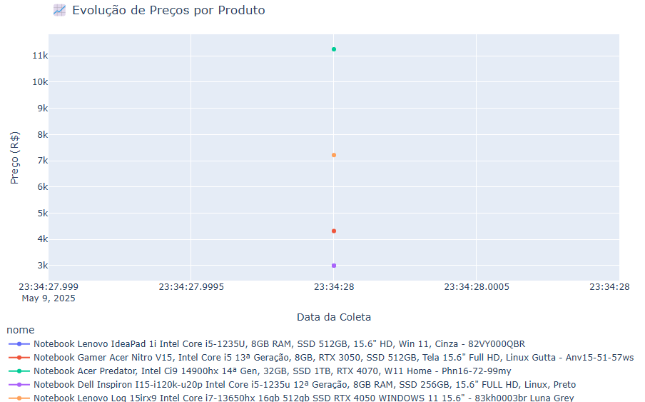

# 🧠 Dashboard Inteligente de Preços - KaBuM!

Este projeto realiza a **coleta automatizada de preços** de produtos na loja [KaBuM!](https://www.kabum.com.br/) usando Selenium, e cria um **dashboard interativo** com análise visual dos preços ao longo do tempo.

## 🚀 Funcionalidades

- 🔍 Web scraping de preços em tempo real com Selenium + ChromeDriver.
- 📊 Armazenamento incremental em CSV com histórico das coletas.
- 🧼 Limpeza de dados para conversão correta dos preços.
- 📈 Visualização interativa com Plotly (linha e barras).
- 📅 Análise da evolução dos preços por produto.

## 🛠️ Tecnologias Utilizadas

- Python 3
- Selenium
- Pandas
- Plotly
- Google Colab

## 📸 Exemplo de Visualização



## 📁 Organização dos Arquivos

```
Dashboard-Inteligente-Precos-KaBuM/
│
├── Dashboard_Inteligente_Preços_KaBuM_FINAL.ipynb   # Notebook completo e funcional
├── exemplo_grafico.png                              # Exemplo visual de gráfico gerado
├── dados_kabum.csv                                  # (opcional) Exemplo de CSV com preços
└── README.md                                        # Este arquivo
```

## 🧠 Como Usar

1. Abra o notebook no [Google Colab](https://colab.research.google.com/)
2. Execute todas as células.
3. Personalize a busca de produtos direto no código.
4. Veja os gráficos interativos e exporte se quiser.

> **Dica**: use tarefas agendadas (ex: no PythonAnywhere ou com cron) para rodar o scraping de tempos em tempos e montar seu próprio histórico de preços!

## 🔗 Autor

Desenvolvido por [Luis Felipe Pessina Gasparini](https://www.linkedin.com/in/luis-felipe-pessina-gasparini-245098358/) 

Se quiser ver mais projetos ou conectar, fique à vontade!

---
**⭐ Dê uma estrela se gostou do projeto!**
